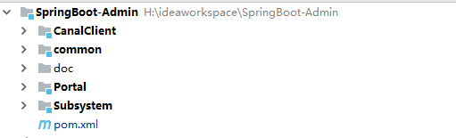
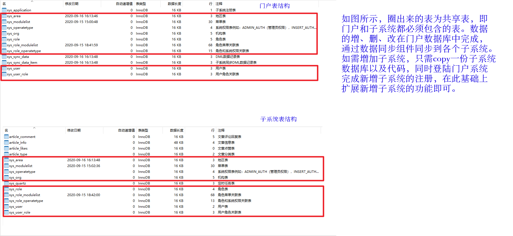
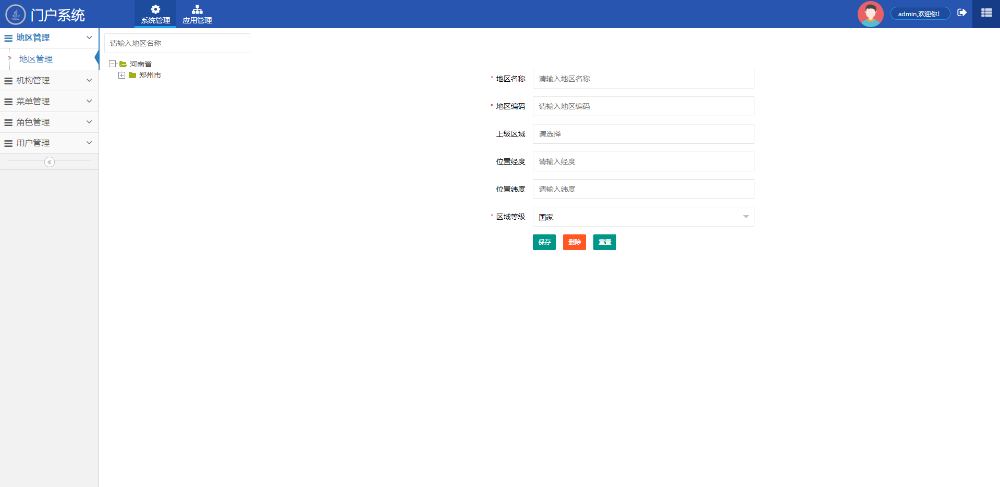
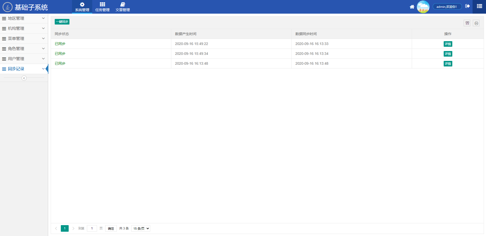
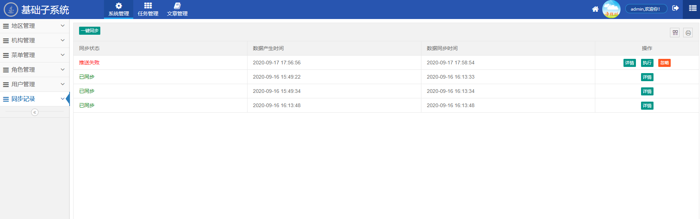
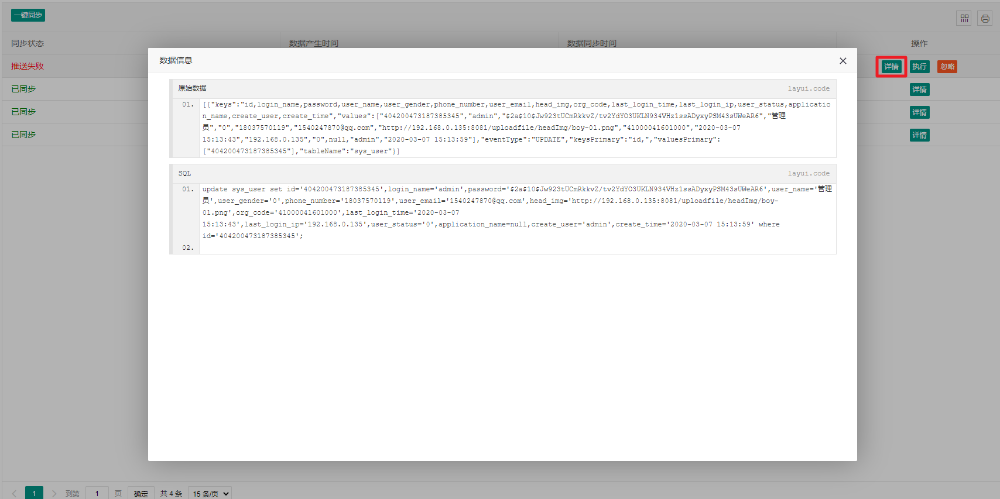

## 门户 + 子系统框架使用说明

### 一、概要

​	该框架主要是将多系统的权限管理进行抽取，形成一个门户系统。门户系统主要包含一些公用数据的维护包括地区管理、机构管理、菜单管理、角色管理、用户管理、应用管理（子系统管理）。门户系统中的基础数据通过阿里巴巴开源组件Canal同步到各子系统，子系统中便可以很方便集成权限管理功能、使用公用数据（包括多表联查）；同时框架使用token机制、结合上边提到的公用用户可以很方便的完成不同系统间的无缝跳转（单点登录）。

#### 1.1 、框架目录结构说明



- SpringBoot-Admin ：父工程
- common ： 公用模块，主要包括一些工具类和实体类
- Portal ：门户系统
- Subsystem ： 门户系统下的一个子系统
- CanalClient : Canal客户端，配合阿里巴巴开源数据同步组件Canal进行基础数据的同步

#### 1.2、数据库表说明



### 二、门户系统

#### 2.2、门户系统功能展示



#### 2.3、注意事项

- 菜单管理

  > ​		门户系统中可以对所有子系统菜单进行管理，但是需要注意一点，子系统菜单的根节点菜单编码必须是子系统的 spring.application.name  的大写。当然一般情况下子系统的根节点以及通用菜单的初始化是在门户系统的应用管理功能中注册该子系统时自动完成的。

- 应用管理

  > ​		新增子系统之前要先再门户系统中完成注册及应用管理中添加一条子系统记录，主要包括应用名称、应用编码、应用的URL。该操作主要是为了初始化子系统的通用菜单，以及后续共享表数据同步时能够同步到该子系统。

### 三、子系统

#### 3.1、子系统功能展示



#### 3.2、注意事项

> ​		相对于门户系统来说，子系统少了应用管理，新增了同步记录、扩展了定时任务可视化管理功能以及文章管理功能

- 子系统数据源

  > 子系统至少要配置两个数据源，子系统自己的数据库management以及门户的数据库portal

  ```yaml
  spring:
    autoconfigure:
      ## 多数据源环境下必须排除掉 DataSourceAutoConfiguration，否则会导致循环依赖报错
      exclude:
        - org.springframework.boot.autoconfigure.jdbc.DataSourceAutoConfiguration
    redis:
      database: 0
      host: 127.0.0.1
      port: 6379
      password: 123456
      lettuce:
        pool:
          #连接池最大连接数（负值表示没有限制）默认8
          max-active: 100
          #连接池中最大空闲连接 默认8
          max-idle: 8
          #连接池中最小空闲连接 默认0
          min-idle: 0
    datasource:
      druid:
        aop-patterns: cn.net.colin.controller.*,cn.net.colin.service.*,cn.net.colin.mapper.*
        management:
          #   数据源基本配置
          url: jdbc:mysql://127.0.0.1:6001/management?allowMultiQueries=true&rewriteBatchedStatements=true&zeroDateTimeBehavior=convertToNull&characterEncoding=UTF-8&serverTimezone=Asia/Shanghai
          driver-class-name: com.mysql.cj.jdbc.Driver
          username: root
          password: root
  #       数据源其他配置
          # 初始化连接数
          initialSize: 1
          # 连接池最小空闲
          minIdle: 1
          # 连接池最大使用连接数量
          maxActive: 20
          # 获取连接最大等待时间
          maxWait: 60000
          timeBetweenEvictionRunsMillis: 60000
          minEvictableIdleTimeMillis: 300000
          validationQuery: SELECT 1 FROM DUAL
          testWhileIdle: true
          testOnBorrow: false
          testOnReturn: false
          #   如果用Oracle，则把poolPreparedStatements配置为true，mysql可以配置为false
          poolPreparedStatements: false
          maxPoolPreparedStatementPerConnectionSize: 20
          #   配置监控统计拦截的filters，去掉后监控界面sql无法统计，'wall'用于防火墙
          filters: stat,wall,slf4j
          #   合并多个DruidDataSource的监控数据
          useGlobalDataSourceStat: true
          connectionProperties: druid.stat.mergeSql=true;druid.stat.slowSqlMillis=500
        portal:
          #   数据源基本配置
          url: jdbc:mysql://127.0.0.1:6001/portal?allowMultiQueries=true&rewriteBatchedStatements=true&zeroDateTimeBehavior=convertToNull&characterEncoding=UTF-8&serverTimezone=Asia/Shanghai
          driver-class-name: com.mysql.cj.jdbc.Driver
          username: root
          password: root
          #       数据源其他配置
          # 初始化连接数
          initialSize: 1
          # 连接池最小空闲
          minIdle: 1
          # 连接池最大使用连接数量
          maxActive: 20
          # 获取连接最大等待时间
          maxWait: 60000
          timeBetweenEvictionRunsMillis: 60000
          minEvictableIdleTimeMillis: 300000
          validationQuery: SELECT 1 FROM DUAL
          testWhileIdle: true
          testOnBorrow: false
          testOnReturn: false
          #   如果用Oracle，则把poolPreparedStatements配置为true，mysql可以配置为false
          poolPreparedStatements: false
          maxPoolPreparedStatementPerConnectionSize: 20
          #   配置监控统计拦截的filters，去掉后监控界面sql无法统计，'wall'用于防火墙
          filters: stat,wall,slf4j
          #   合并多个DruidDataSource的监控数据
          useGlobalDataSourceStat: true
          connectionProperties: druid.stat.mergeSql=true;druid.stat.slowSqlMillis=500
  ```

  

- 菜单管理

  > 子系统的菜单管理只能管理本系统的菜单

- 同步记录

  > ​		CanalClient 会把监听到的门户系统中的共享表的变化推送到子系统，如果推送失败，或者子系统处理该条推送出错可以在同步记录中找到该条记录进行人工干预处理。由于数据的同步需要顺序执行，所以只要有一条失败记录，后续的记录都将不再自动同步，此时可以登录子系统首先处理第一条失败记录，完成同步或者忽略，然后点击一键同步完成后续记录的一键式同步

  

  - 点击详情可以查看详细数据包括原始数据以及解析成SQL后的数据，如果出现程序不能自动处理的数据比如id重复（当然本框架中使用雪花算法生成id不太可能出现id重复，这里只是举例说明），可以找到该条记录复制SQL修改id在外部执行修改后的SQL，然后再这里点击忽略即可。

  